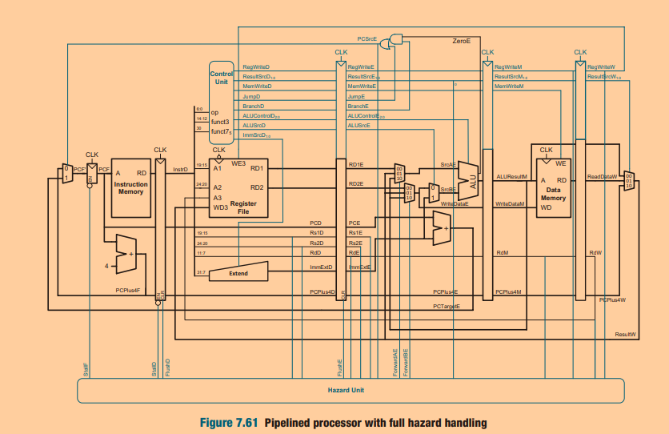
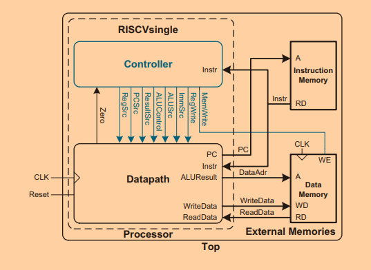

This RISC-V RV32I Processor is based on the great book "Digital Design and Computer Architecture" by Sarah L harris and David Money Harris.

This processor is a simple single-core pipelined processor, capable of handling data and control hazards.

It cannot execute the full set of RV32I instructions, such as lb, U-type instructions, and some B-type instructions. The complete RV32I processor will be posted later.
The purpose of this project was to learn and demonstrate the RISC-V architecture. Similar projects with single-cycle architecture and multi-cycle architectures can be found in my repositories.

